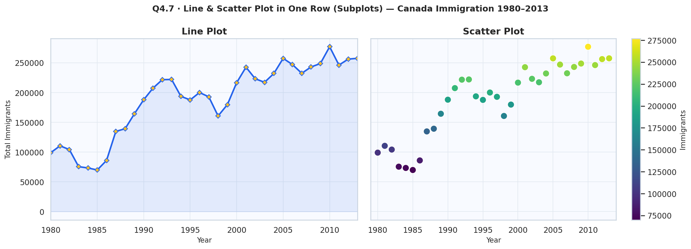
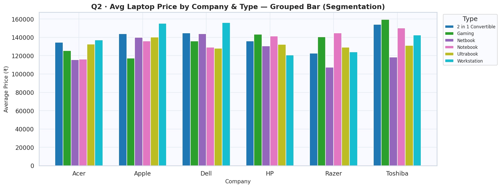
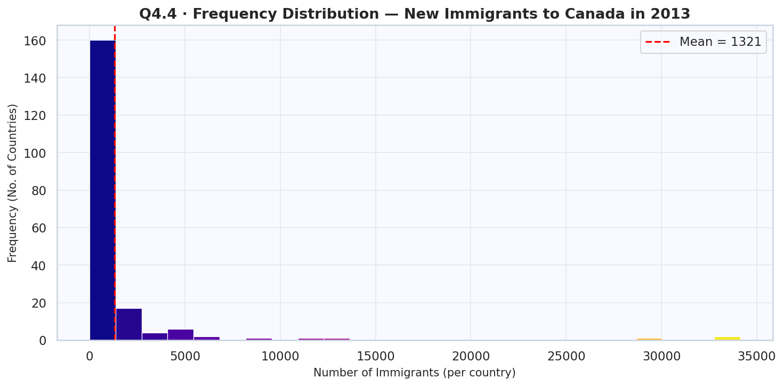

# 📊 Data Visualization & Analytics (DVA) Project


A comprehensive data analytics project demonstrating professional data wrangling, preprocessing, statistical hypothesis testing, and advanced data visualization. This project processes three distinct datasets (Canada Immigration, Laptop Pricing, and Medical Insurance) and generates a polished, academic-grade PDF report programmatically.

---

## ✨ Project Highlights

### 1. Data Wrangling (Canada Immigration Dataset)
- Aggregated 34 years of immigration data (1980–2013) to compute cumulative totals.
- Handled completely clean datasets with programmatic null-value verification.
- Extracted and ranked the Top 5 contributing countries globally.

### 2. Data Preprocessing (Laptop Dataset)
- **Robust Imputation:** Utilized Median imputation for numerical features (RAM, Weight) to resist outliers, and categorical placeholders for missing GPUs.
- **Feature Scaling:** Applied both `StandardScaler` (Z-score) and `MinMaxScaler` (0-1 range) to pricing data.
- **Categorical Encoding:** Leveraged `LabelEncoder` to convert categorical text (Company, CPU, OS) into numerical indicators for ML readiness.

### 3. Statistical Hypothesis Testing (Insurance Dataset)
Conducted rigorous statistical tests with `α = 0.05` to validate real-world medical data:
- **Independent T-Tests:** Validated that Smokers pay significantly higher medical charges, while male and female BMIs show no significant statistical difference.
- **Pearson Correlation:** Confirmed a positive linear correlation between age and medical charges.
- **Chi-Square Test:** Proved that smoking proportions are independent of geographic regions.
- **One-Way ANOVA:** Verified that women's BMI does not significantly fluctuate based on the number of children (0, 1, or 2).

### 4. Advanced Data Visualization
Generated 19 high-resolution, customized plots using Matplotlib & Seaborn. Features include:
- **Custom aesthetics:** Hex color palettes, specialized markers, dynamic alpha grids, and custom sizing.
- **Complex layouts:** Multi-axis subplots sharing Y-axes, stacked bar charts, and exploded pie charts.
- **Distribution tracking:** Frequency histograms and notch-box plots to visualize quartiles and outliers.

---

## 📈 Visual Gallery

Here are some highlights of the visualizations generated by the pipeline:

<p align="center">
  
</p>
<p align="center">
  <em>Figure 1: Dual subplot comparing chronological line trends with volume-encoded scatter mapping.</em>
</p>

<p align="center">
  
</p>
<p align="center">
  <em>Figure 2: Grouped bar charting showing price segmentation across laptop brands and form factors.</em>
</p>

<p align="center">
  
</p>
<p align="center">
  <em>Figure 3: Frequency distribution of 2013 immigration metrics featuring a right-skewed tail and mean indicator.</em>
</p>

---

## 🛠️ Architecture & Files

The project is structured into modular Python scripts to separate logic, visualization, and PDF generation:

| File | Purpose |
|------|---------|
| `make_plots.py` | The core analytics engine. Loads datasets, runs statistical tests, and saves 19+ plots. |
| `build_pdf.py` | The report generator. Uses `ReportLab` to compile analytics and plots into a premium PDF. |
| `build_notes_pdf.py` | Generates a conceptual "Viva Notes" cheat sheet explaining p-values, tests, and metrics. |
| `akshat.pdf` | The final rendered, 12-page academic project report. |
| `viva_notes.pdf` | The rendered study guide/notes for the assignment. |

---

## 🚀 How to Run

1. **Install Dependencies:**
   ```bash
   pip install pandas numpy matplotlib seaborn scipy scikit-learn reportlab openpyxl
   ```
2. **Generate Plots & Analytics:**
   ```bash
   python make_plots.py
   ```
3. **Compile the Reports:**
   ```bash
   python build_pdf.py
   python build_notes_pdf.py
   ```

---
*Developed by Akshat Tripathi*
