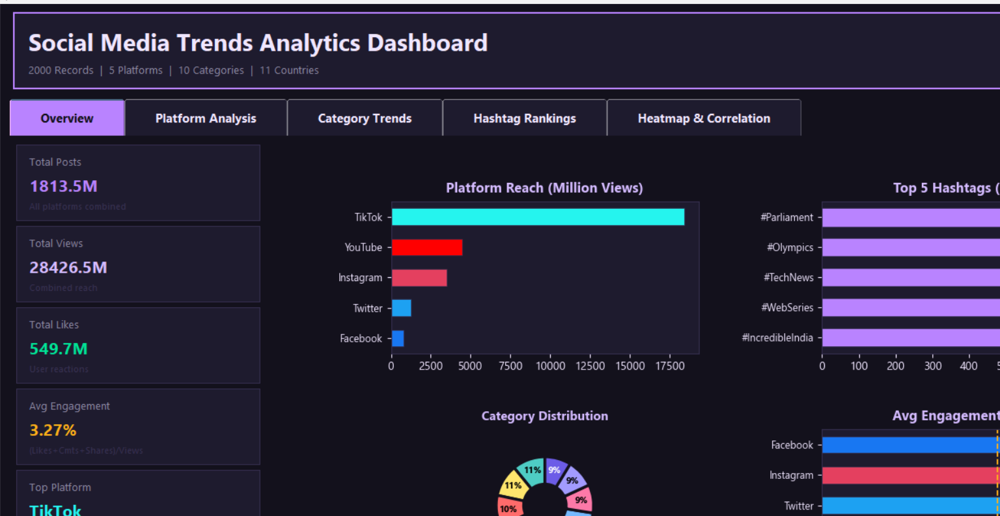
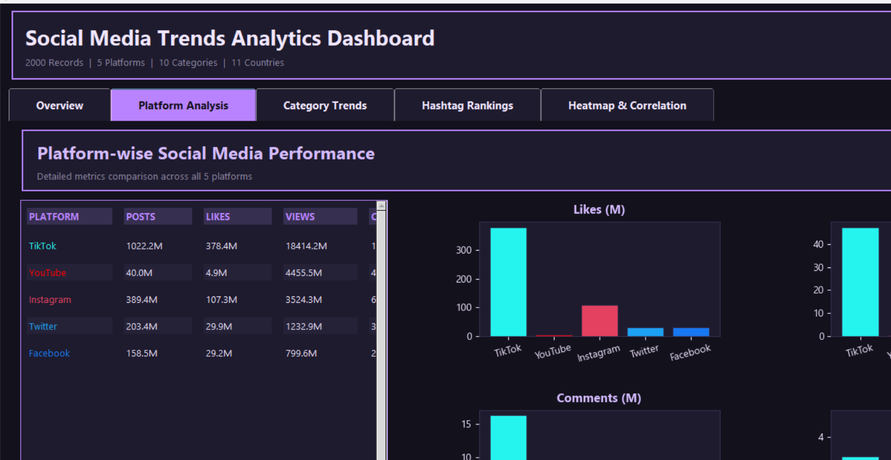
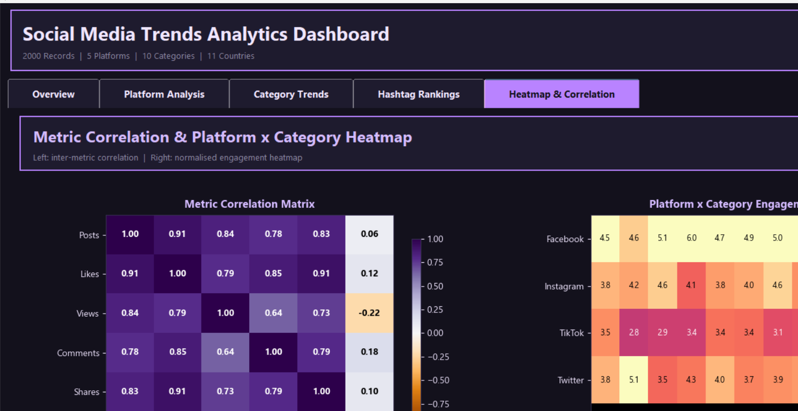
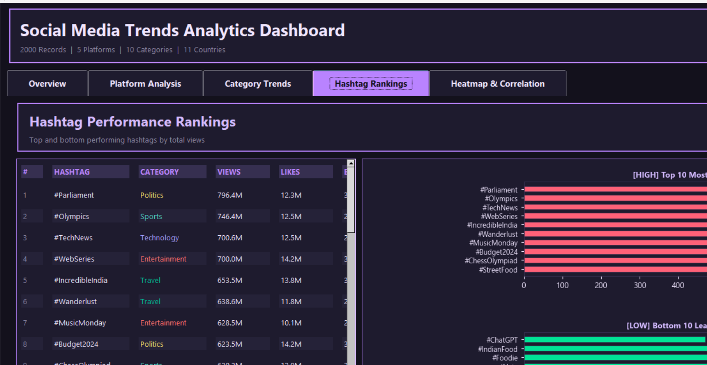
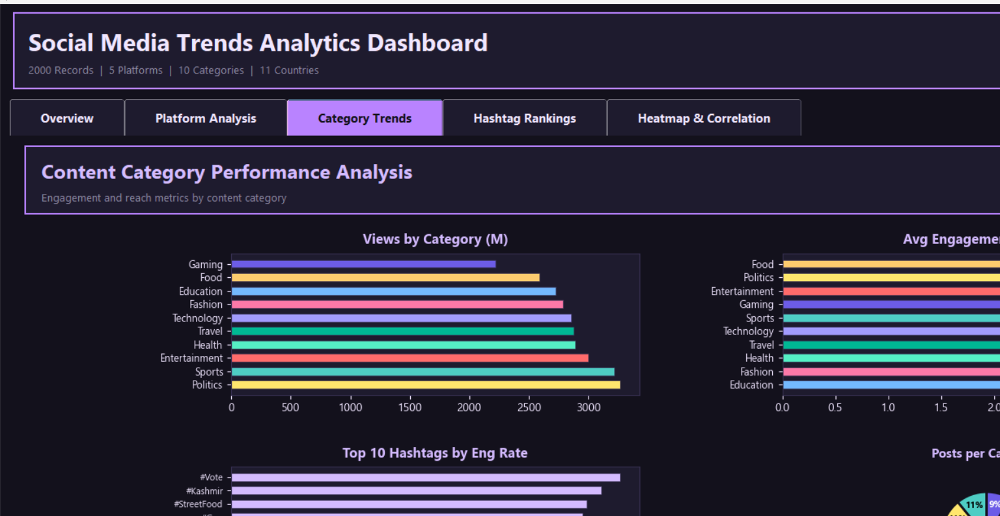

<div align="center">
  <h1>📊 Social Media Trends Analytics Dashboard</h1>
  <p><strong>DVA Assignment 2 | Data Visualization & Analytics Project</strong></p>

  <p>
    <a href="https://github.com/akshat7081/DVA-Project"></a>
    
    
    
    
  </p>

  <p>
    A comprehensive interactive <strong>Social Media Trends Analytics Dashboard</strong> demonstrating professional data visualization, data wrangling, and analytics. 
  </p>
</div>

---

## 🔗 Project Link
**Live Repository:** [https://github.com/akshat7081/DVA-Project](https://github.com/akshat7081/DVA-Project)

## ✨ Project Highlights

This project processes a custom dataset with **2000 records** of social media trend data to generate a multi-page interactive dashboard. 

### 1. Interactive Dashboard Pages
- 📈 **Overview:** Executive summary displaying key KPIs, platform reach, category distribution, top hashtags, and average engagement rates.
- 📱 **Platform Analysis:** Detailed metrics comparison across 5 major platforms (Twitter, Instagram, YouTube, Facebook, TikTok) with multi-metric bar charts.
- 🎯 **Category Trends:** Engagement and reach metrics by content category (Entertainment, Sports, Technology, etc.) including top hashtags and content output distribution.
- #️⃣ **Hashtag Rankings:** Comprehensive ranking table for top and bottom performing hashtags by total views.
- 🔥 **Heatmap & Correlations:** Statistical relationships shown via a Correlation Matrix and Platform vs Category engagement intensity heatmap.

### 2. Custom GUI & Premium Styling
- **Midnight Purple Theme:** A modern, sleek appearance with high contrast and carefully selected colors that match top-tier analytics tools.
- **Responsive Layouts:** Designed to adapt to the screen, providing scrollable data tables and interactive visual modules.
- **Standardized Visualizations:** Integrating customized Matplotlib charts embedded directly into a Tkinter GUI for an immersive experience.

### 3. Data Processing & Validation
- **Dynamic Aggregation:** Rapid and efficient Pandas aggregation for calculating platform metrics and engagement.
- **Robust Formatting:** Cleaned labels and formatted large numeric values for better UI representation.
- **Data Validation:** Included data integrity checks before visualization processing.

---

## 🖼️ Dashboard Screenshots

### 1. Executive Overview

*Executive summary with KPIs, Platform Reach, Category Distribution, and Top Hashtags.*

### 2. Platform Analysis

*Detailed metrics across Twitter, Instagram, YouTube, Facebook, and TikTok.*

### 3. Category Trends

*Engagement and reach metrics distributed across 10 content categories.*

### 4. Hashtag Rankings

*Deep dive into hashtag performance, comparing the most and least viewed tags.*

### 5. Heatmap & Correlations

*Matrix and Heatmap visualizing engagement intensity and correlations.*

---

## 🛠️ Architecture & Files

The project is structured into modular Python scripts to separate logic, visualization, and generation tasks:

| File / Folder | Purpose |
|------|---------|
| `dashboard.py` | The main dashboard application. Defines UI pages, handles aggregations, and embeds Matplotlib plots. |
| `generate_pdf.py` | The report generator. Creates a polished `.docx` academic report of the assignment, then converts it to a PDF. |
| `generate_dataset.py` | Python script that generates the realistic 2000-record dataset. |
| `Social_Media_Trends_India.csv` | The custom social media dataset utilized by the dashboard. |
| `DVA_Assignment_2_Akshat_Tripathi.pdf` | The final rendered, 21-page academic project report. |
| `screenshots/` | Folder containing high-resolution images of the dashboard in action. |

---

## 🚀 Quick Start Guide

### 1. Clone the Repository
```bash
git clone https://github.com/akshat7081/DVA-Project.git
cd DVA-Project
```

### 2. Install Dependencies
Ensure you have Python 3.11+ installed. Then run:
```bash
pip install pandas numpy matplotlib python-docx docx2pdf
```

### 3. Run the Dashboard Application
Launch the interactive dashboard:
```bash
python dashboard.py
```

### 4. Generate the Academic Report
Compile the Python code and visualizations into an academic document:
```bash
python generate_pdf.py
```

---
<div align="center">
  <p><em>Developed with ❤️ by Akshat Tripathi</em></p>
</div>
